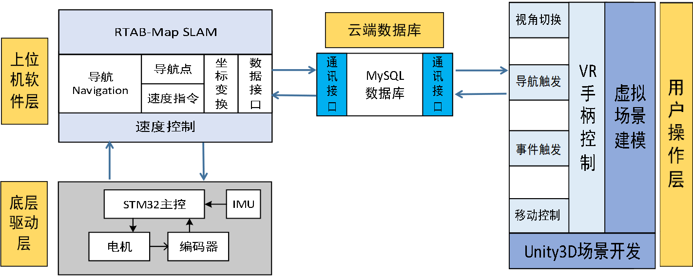
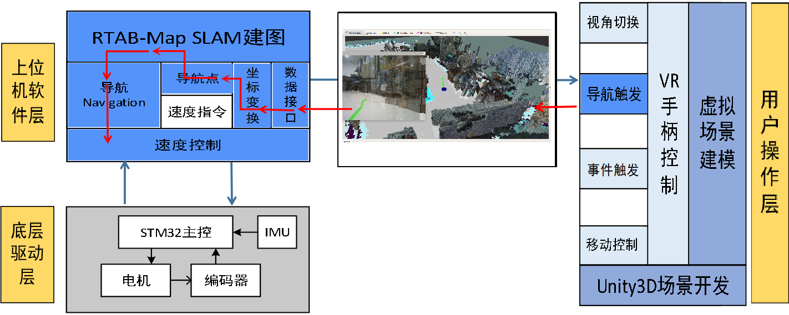
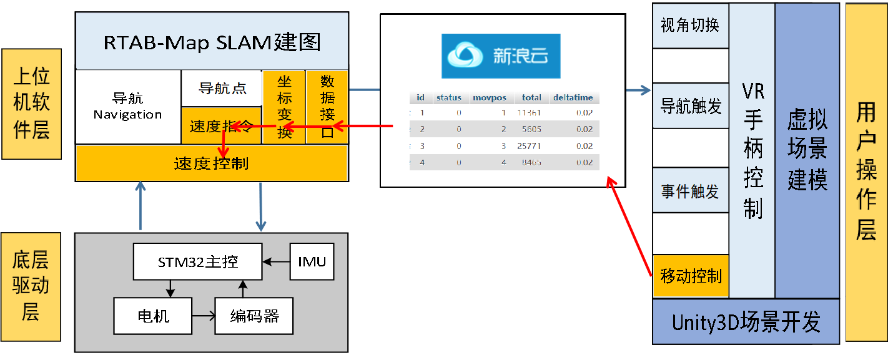
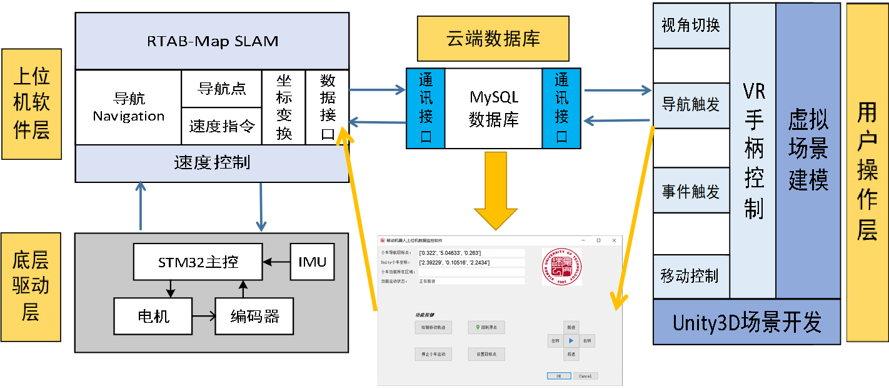
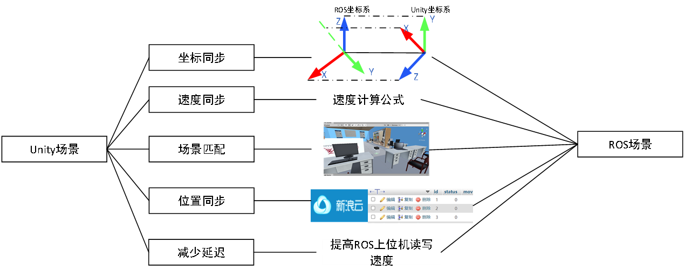

# 基于ROS智能巡检机器人系统开发

**项目描述**：该项目旨在通过目标识别、机器人控制和 SLAM 建图等，实现工业现场检测和任务执行。

个人工作：

- 机器人开发：Ubuntu 18.04 环境编写移动机器人位姿发布与订阅的 ROS 节点、远程控制节点以及基于 MySQL C API 编写数据下载和上传到新浪云服务器数据库的传输节点；

- 通过激光雷达和 Gmapping 部署建图与自主导航功能包；建立现场局域网通信（路由组网）。

- 数据库存储：新浪云服务器上挂载 PHP 脚本自动接收并存储数据到新浪云 MySQL 数据库。

- 目标识别：采集设备图片 Labelme 标注，采用 Yolov4-tiny 模型训练并部署检测模型

- 人机交互：基于 PyQT5 开发人机交互界面，从云端获取数据；指令等控制信号上传云端。

---

## 文件夹

cloud_code 是挂载在新浪云上的代码。

myRosspace 是在轮式机器人上的ROS工作空间。

---

## 运动学模型

## 软件系统框架

- 手柄遥操作

- 激光SLAM导航

- 上位机界面监视

- 虚拟场景操作

## ROS节点设计

## 手柄操作

## 激光雷达Gmapping建图效果

Gmapping它已经集成在ROS的功能包中，是移动机器人导航中使用最多的SLAM建图算法。

## RTAB-Map SLAM

## 手柄遥操作

在ROS中，C++通过mysql_real_connect函数可以连接到新浪云数据库，通过向数据库发送SQL查询，直接读取所需的数据，然后再交给ROS节点进行数据的处理。

## 上位机操作

## 虚拟场景建模与现实同步

